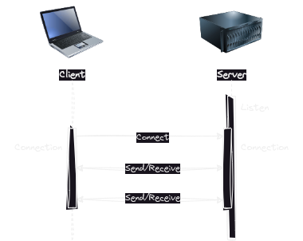

# Cryptography Workshop

## Background

In today's workshop you are going explore some cryptographic concepts with some
hands-on exercise.

In general, you should prefer using existing cryptographic protocols where
possible.
Because any small mistake can leave it vulnerable.
However, it is still good to have some experience in working with various
algorithms to know how to use them and what pitfalls or limitations there are.

For the exercises to make sense you will be working in a setting where two
applications are communicating over the network.
Both applications can run on your own machine.
Just pretend there is a malicious person
[sniffing](https://en.wikipedia.org/wiki/Sniffing_attack) the traffic between
the applications.

Create your solution to the exercises as a console application.
It is okay to hard-code the messages.

## Sockets

I think the easiest way to get started is simply to use raw TCP sockets.

Since the majority of students in the class are working in .NET, then I've made
a small wrapper around the built-in socket, that can make it a bit easier to
work with.
See
[SocketWrapper.cs](https://gist.github.com/rpede/71e406c9d287aac4cd5eaf4aa3722d2b).

You can layer JSON on top if you need more structure to the messages
send/received.

You are not required to use a specific programming language in this course.
So, you can use whatever programming language you prefer for the exercises.
Here are some links to learn more about sockets in various programming
languages.

- [TCP Overview in .NET](https://learn.microsoft.com/en-us/dotnet/fundamentals/networking/sockets/tcp-classes)
- [Python - Socket Programming HOWTO](https://docs.python.org/3/howto/sockets.html)
- [A Guide to Java Sockets](https://www.baeldung.com/a-guide-to-java-sockets)
- [Socket.IO (JavaScript)](https://socket.io/)

You will need two programs.
One that listens for connections (server).
And another that connects to the first (client).

Once a connection have been established, client and server can
send messages back and forth.

Client or server can simply take turns either sending or receiving messages.

## Crypto libraries

You will need a crypto library that implements the various algorithms referred
to in the exercises.
Here are some:

**.NET**

- [System.Security.Cryptography](https://learn.microsoft.com/en-us/dotnet/api/system.security.cryptography)

**Python**

- [PyCryptodome](https://www.pycryptodome.org/)
- [cryptography](https://cryptography.io/)

**Node.js**

- [Crypto](https://nodejs.org/api/crypto.html)

Prefer built-in libraries over 3rd party libraries.
If an algorithm isn't provided by built-in library then pick a popular 3rd
party.

## Exercises

### Exercise 1

Send an encrypted message over the socket.
The messages must be decrypted on the other end using a pre-shared symmetric
key.

You can use AES-GCM as cipher.
Remember IV needs to be unique each time you encrypt a message.
Use a [Cryptographically secure pseudorandom number
generator](https://en.wikipedia.org/wiki/Cryptographically_secure_pseudorandom_number_generator)
such as
[RandomNumberGenerator](https://learn.microsoft.com/en-us/dotnet/api/system.security.cryptography.randomnumbergenerator).

For .NET see [Authenticated Encryption in .NET with
AES-GCM](https://www.scottbrady91.com/c-sharp/aes-gcm-dotnet).

### Exercise 2

The same as in previous exercise, but use an encryption key derived from a
password instead.

In .NET there are two implementations of
[PBKDF2](https://en.wikipedia.org/wiki/PBKDF2).
[KeyDerivation.Pbkdf2](https://learn.microsoft.com/en-us/dotnet/api/microsoft.aspnetcore.cryptography.keyderivation.keyderivation.pbkdf2) and [Rfc2898DeriveBytes.Pbkdf2](https://learn.microsoft.com/en-us/dotnet/api/system.security.cryptography.rfc2898derivebytes.pbkdf2?).

For [Argon2](https://en.wikipedia.org/wiki/Argon2),
[scrypt](https://en.wikipedia.org/wiki/Scrypt) and
[bcrypt](https://en.wikipedia.org/wiki/Bcrypt) you might need a 3rd party
package.

### Exercise 3

Same as previous, but use a variant of [Diffie–Hellman key
exchange](https://en.wikipedia.org/wiki/Diffie%E2%80%93Hellman_key_exchange)
instead of having a pre-shared key / secret.

Make a DHKE between the communicating parties.
Then encrypt the message at one end using the resulting key.
Decrypt at the other end.

You can use Elliptic Curve Diffie-Hellman.
For .NET use
[ECDiffieHellman](https://learn.microsoft.com/en-us/dotnet/api/system.security.cryptography.ecdiffiehellman?view=net-8.0).

Note: you will need to export the public key and send it to the other end.

### Exercise 4

Modify your solution from previous exercise such that a [session
key](https://en.wikipedia.org/wiki/Session_key) is used to encrypt the message.

On the end that is sending the message, you should:

1. Generate a random key `SK` (used as session key)
2. Use `SK` to encrypt the message
3. Encrypt `SK` using the shared secret from DHKE
4. Send the encrypted message + encrypted `SK` to receiver

On receiving end:

1. Decrypt `SK` using shared secret from DHKE
2. Decrypt message using `SK`

Elliptic Curve (EC) cryptography can **not** encrypt data directly.
A hybrid crypto system is used to provide encryption with EC.
Hybrid means combining symmetric and asymmetric cryptography like in this
exercise.

Is your solution safe from [man-in-the-middle
attacks (MITM)](https://en.wikipedia.org/wiki/Man-in-the-middle_attack)?
What will it take to make it resilient against MITM attacks?
