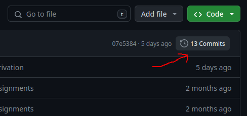
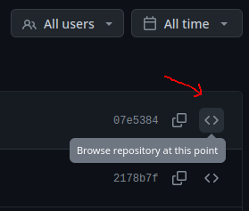

# Mini Project

## Intro

Many services we use every day rely on passwords for security.
With 2fa not always being an option.
To protect yourselves from the inevitable data breach, it's important that you
use a unique strong password for each service.

Remembering so many passwords is not feasible for most people.
That's why password managers are handy.

A password manager helps the user keep track of credentials.
Generally, it requires a method of authenticating to "unlock", which provides
access to all stored credentials.

They also often provide mechanisms to help organize credentials and generate
strong passwords.

[More](https://en.wikipedia.org/wiki/Password_manager)

## Goal

The goal of this assignment is to develop a simple password manager.

The password manager must be capable of safely storing credentials on a single
computer/device.
It should also provide functionality for generating strong passwords.

Security and usability are the main priorities!

You are allowed to work in groups.
However, the requirements increase with the group size.

- 1 person: Focus on safely storing on a single device.
- 2 people: More emphasis on user interface - making it easy to use securely.
- 3 persons: Plan for how a user can access their credentials across devices.
- 4 persons: Implement a way to access credentials across devices.

In addition to the program itself, you also need to provide setup instructions
and a description of your security model.
It is strongly recommended that you get feedback on the security model from
your teacher before hand-in.

Project is compulsory/mandatory!

## Scale

The project will span two weeks.

You are very welcome to work in groups.
But each person in the group needs to make a reasonable contribution to the
project.
So, if there are 4 people in a group there must be contributions from for people.

During the project you must design, program and document the security features
of your product.
I expect that you will spend the majority of the time on programming.

I'm not going judge too harshly if the implementation has a couple of rough edges.
However, I will put a lot of emphasis on the security considerations.
Both from a technical point of view and from a human aspect.

## Technical

You can implement it in whatever programming language, runtime and technology
you want to.

You can store/manage passwords in a local database/vault.
The file format is up to you.

You must take appropriate measures to protect the database/vault.

You must argue for any cryptographic decisions you make.

Your application should also provide a mechanism to generate secure passwords.

## Deliverable

In addition to the code, your deliverable must include a discussion about the
security of your product.
You should argue for the security considerations you made and document any
pitfalls.

You must include Instructions on how to get the application up and running.
It should include all required steps for someone that just cloned the
repository.
Including (if applicable) instructions for setting up the database.

In setup instructions, you can assume the reader knows how to install language
runtime required.
Such as .NET SDK, Python, Node.js and so on.

## Hand-in

Link to a GitHub repository.
The link must include commit hash.
The commit must include working code.

The repo must include a `README.md` containing a description of the security
model of your product and setup instructions.

- Instructions to run the application.
- Screenshots of the product.
- Discussion about security of your product.
  - What do you protect against (who are the threat actors)
  - What is your security model (encryption, key handling etc.)
  - Any pitfalls or limitations in your solution.

Including diagrams will be appreciated.
You can use [draw.io](https://app.diagrams.net/) or some other tool.
Any graphics must be embedded within the `README.md`.

Prioritize quality over word count!

**Important:**
Make sure your project is **public**, so I can access it!!!

## Link to a commit

Here is how you get a link to GitHub repository including a commit hash.

First navigate to your repository.
Then open the commit history by clicking on the "x Commits" button.

Then click the browse button.

Copy link from address bar.
