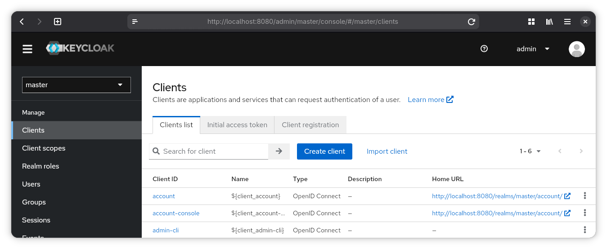
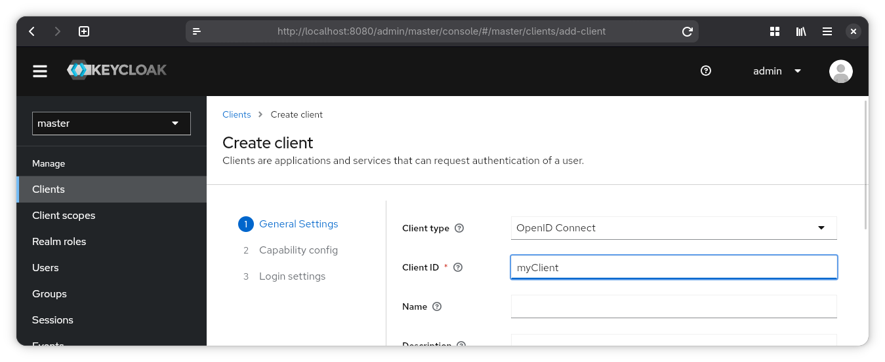
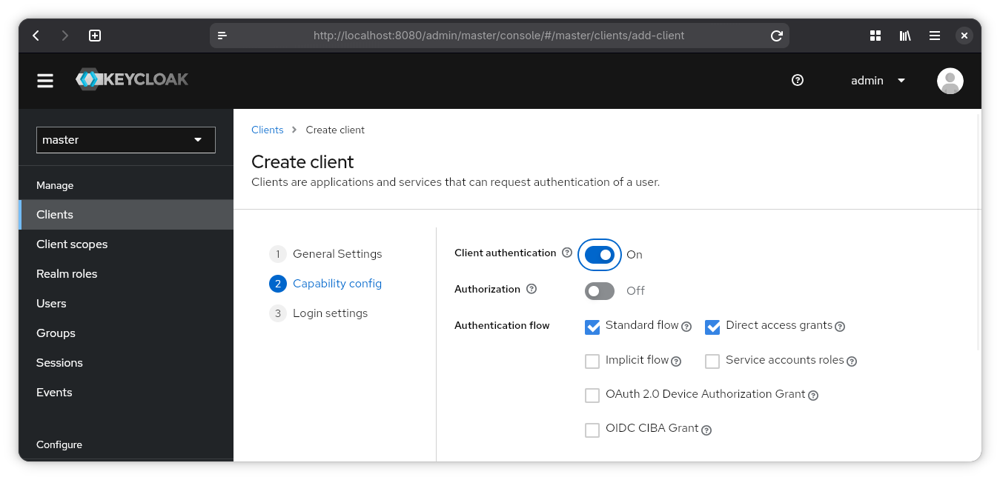
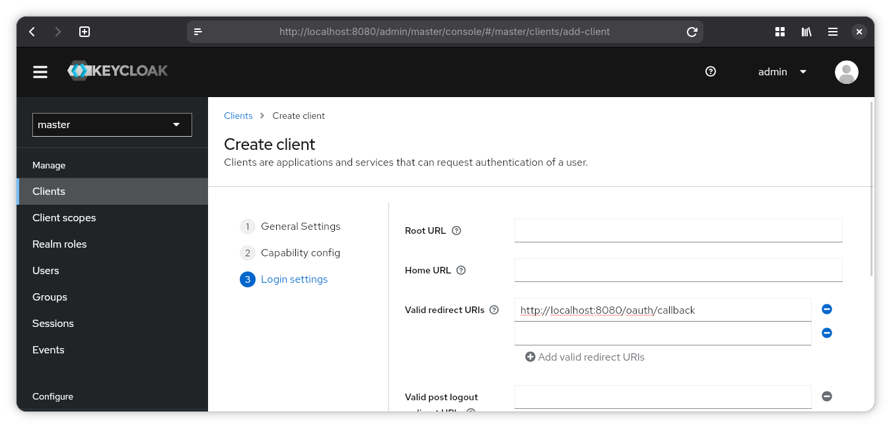
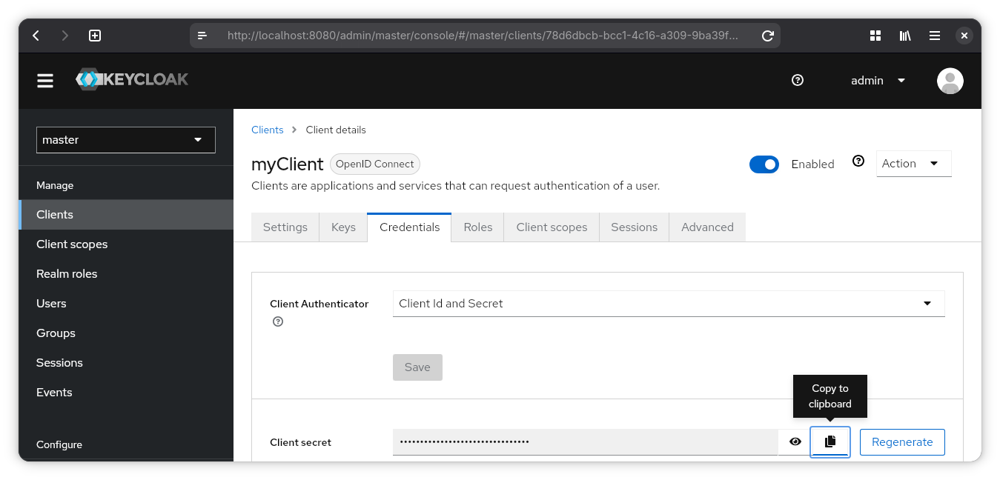

# OAuth 2.0 + OpenID Connect setup guide

This guide assumes that you have Docker installed.

You can find instructions on how to install docker engine
[here](https://docs.docker.com/engine/install/).

## Identity Provider

Set up an identity provider with:

```sh
docker run -p 8080:8080 -e KEYCLOAK_ADMIN=admin -e KEYCLOAK_ADMIN_PASSWORD=admin quay.io/keycloak/keycloak:21.1.0 start-dev
```

See for details [Keycloak Docker](https://www.keycloak.org/getting-started/getting-started-docker)

Open [http://localhost:8080/admin/](http://localhost:8080/admin/) and login with username=admin and password=admin

## Configure client

Under "Clients" in sidebar, click "Create Client".



**General Settings**

Client Type: OpenID Connect

Client ID: type an ID for your client



**Capability Config**

Make sure that "Client authentication" is on.



**Login Settings**

Valid redirect URIs: callback / redirect of your client

Now "Save"

_You might not know the redirect URI before starting to implement the client.
So come back and adjust later._



**Credentials**

You can now find client credentials under the "Credentials" tab.



## Endpoints

You can find all the endpoints by going to "Realm settings" then open [OpenID Endpoint Configuration](http://localhost:8080/realms/master/.well-known/openid-configuration).
