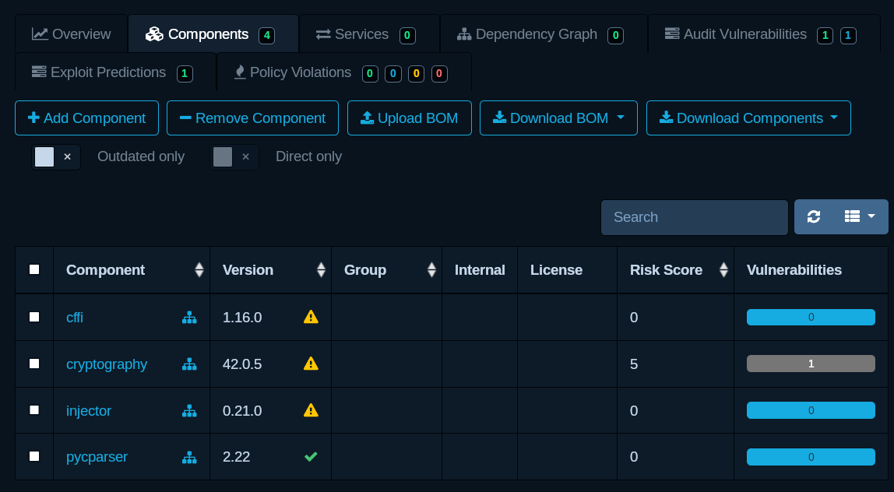

# Dependencies

<!--toc:start-->
- [Dependencies](#dependencies)
  - [Avoid typo-squatting](#avoid-typo-squatting)
  - [Scan dependencies](#scan-dependencies)
    - [Node](#node)
    - [Python](#python)
    - [.NET](#net)
    - [Java](#java)
      - [Maven](#maven)
      - [Gradle](#gradle)
  - [Software Bill of Materials (SBOM)](#software-bill-of-materials-sbom)
    - [npm (SBOM)](#npm-sbom)
    - [.NET (SBOM)](#net-sbom)
    - [Python (SBOM)](#python-sbom)
  - [Analyze SBOM](#analyze-sbom)
    - [Analyze](#analyze)
    - [Vulnerability sources](#vulnerability-sources)
<!--toc:end-->

## Avoid typo-squatting

A common tactic for distributing malicious package is to register a package with a similar name to another popular package, and hope people mistype the package name.
A way to avoid this issue is to check download count before adding a package to
your project.

I therefore recommend either copy-paste package name from the official documentation.
Or search for the package on the repository site for your programming language.

Unfortunately, not all package repository makes this super easy.

**NPM**

<https://www.npmjs.com/>

Just look at "Weekly downloads" on the panel to the right.

**PyPI**

<https://pypi.org/> doesn't show download stats.
Instead, there are several other sites that provide it such as
<https://pypistats.org/>.

**Maven**

I don't know.
Please tell me if you know.

**NuGet**

<https://www.nuget.org/> shows download numbers directly in the search results.

## Scan dependencies

The projects you work on likely have some dependencies, and those dependencies
have other dependencies.
All that quickly adds up.

New vulnerabilities are often discovered in open source packages.
It is important that you are able to tell if a discovered vulnerability affects
your project and take action quickly.

Manually looking at vulnerabilities lists and comparing with dependencies for
all your project is a hassle and unfeasible for most.

Luckily there are tools out there to automate this process.

### Node (Scan)

This is very simple, since it is build in to the package manager.

**Scan**

```sh
npm audit
```

**Fix**

```sh
npm audit --fix
```

### Python (Scan)

For Python packages we need to install a tool.
I strongly recommend using a [virtual
environment](https://realpython.com/python-virtual-environments-a-primer/) to
install packages for your Python projects.

Make sure you have the `venv` for activated for your project.

```sh
pip install pip-audit
```

**Scan**

To scan your local environment.

```sh
python -m pip_audit -l
```

To scan `requirements.txt`.

```sh
python -m pip_audit -r requirements.txt
```

**Fix issues**

```sh
python -m pip_audit -r requirements.txt --fix
```

### .NET (Scan)

**Scan**

```sh
dotnet list package --vulnerable --include-transitive
```

**Fix**

There is no command built-in to just update vulnerable packages.
What you can do instead is to upgrade all outdated dependencies.

```sh
dotnet tool install --global dotnet-outdated-tool
dotnet outdated --upgrade
```

### Java (Scan)

Unfortunately a vulnerability isn't built-in.
But, you can fairly easily add one as a plugin.

#### Maven

Add to `pom.xml`

```xml
<plugin>
    <groupId>org.owasp</groupId>
    <artifactId>dependency-check-maven</artifactId>
    <version>11.0.0</version> <!-- Change to latest version -->
    <executions>
        <execution>
            <goals>
                <goal>check</goal>
            </goals>
        </execution>
    </executions>
</plugin>
```

```sh
mvn verify
```

#### Gradle

Add to `build.gradle`

```groovy
plugins {
    id 'org.owasp.dependencycheck' version '11.0.0' // Change to latest version
}
```

```sh
./gradlew dependencyCheckAnalyze
```

## Software Bill of Materials (SBOM)

### npm (SBOM)

```sh
npm sbom --sbom-type application --sbom-format cyclonedx --legacy-peer-deps > bom.json
```

### .NET (SBOM)

```sh
dotnet tool install --global CycloneDX
dotnet-CycloneDX --set-type Application --output-format json Project.csproj
```

### Python (SBOM)

CycloneDX can be used to.
It is a dependency of pip-audit, but can also be installed alone with:

```sh
pip install cyclonedx-bom
```

It can generate SBOM from `requirements.txt` with:

```sh
python3 -m cyclonedx_py requirements
```

See [CycloneDX Python SBOM Generation Tool](https://github.com/CycloneDX/cyclonedx-python)

## Analyze SBOM

A tool like Dependency-Track can be used to analyze SBOM.

```sh
# Downloads the latest Docker Compose file
curl -LO https://dependencytrack.org/docker-compose.yml

# Starts the stack using Docker Compose
docker compose up -d
```

Open <http://localhost:8080/>

**Login**

- Username: admin
- Password: admin

### Analyze

1. Create a project
2. Go to "Components" tab for the project and upload the SBOM
3. Refresh and inspect the results



### Vulnerability sources

**GitHub Advisory:**

Go to "Administration" -> "GitHub Advisories" and insert your personal access
token.

**Google OSV Advisory**

Go to "Administration" -> "Google OSV Advisories (Beta)", under "Ecosystem" add
npm, NuGet, PyPi or whatever sources of dependencies are used in your project.

[Documentation](https://docs.dependencytrack.org/)
